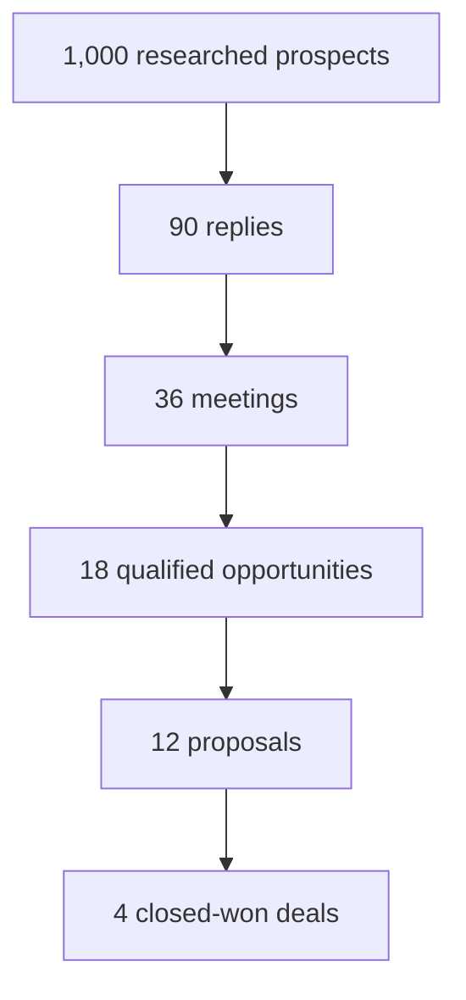
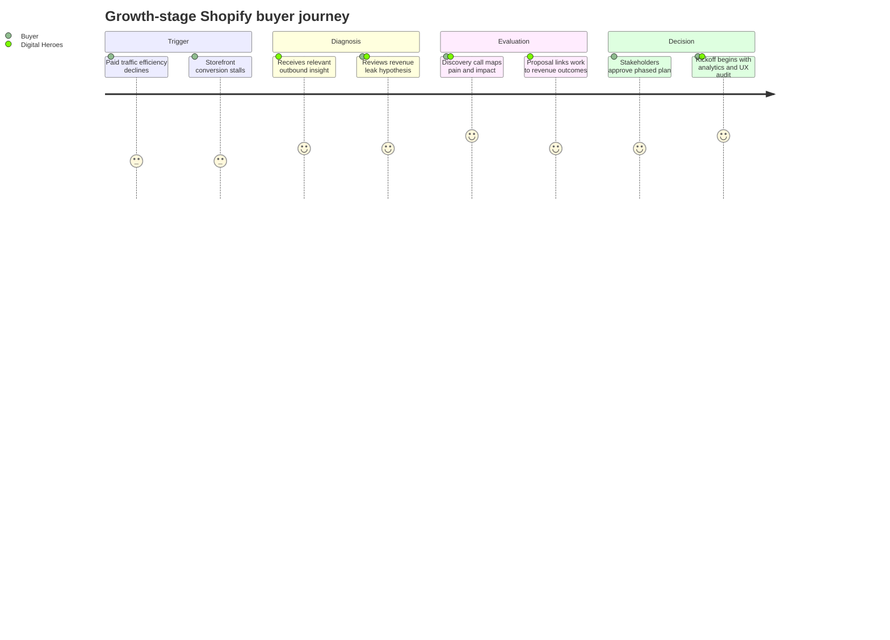
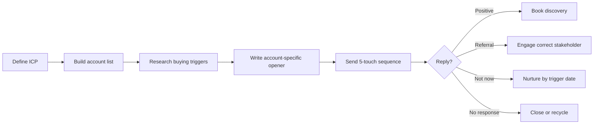
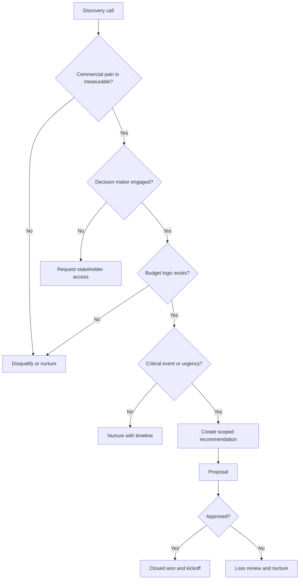

# Task A — Outbound Business Development System

## 1. Market segmentation

Digital Heroes should segment the market by **revenue pressure, digital maturity, buyer accessibility, and service fit** rather than by geography alone. The United States, United Kingdom, and Australia are attractive because they contain mature ecommerce, professional services, SaaS, and performance marketing ecosystems where buyers understand the value of specialist digital execution.

### Segment 1 — Growth-stage Shopify and DTC ecommerce brands

| Dimension | Detail |
|---|---|
| Industry | Fashion, beauty, wellness, consumer goods, specialty retail, homeware, food and beverage, subscription ecommerce. |
| Company size | 15–150 employees. |
| Revenue range | $3M–$30M annual online revenue. |
| Decision maker | Founder, CEO, Head of Ecommerce, Ecommerce Director, VP Marketing, Growth Lead. |
| Buying trigger | Conversion rate has stalled, paid media efficiency is declining, site speed is hurting revenue, the brand is preparing a launch, or the current Shopify store cannot support growth. |
| Biggest pain points | High CAC, poor conversion rate, checkout friction, weak landing pages, slow storefront performance, unreliable tracking, low repeat purchase rate, and dependence on disconnected freelancers. |
| Existing alternatives | Freelance Shopify developers, Shopify theme shops, CRO agencies, paid media agencies, internal marketer plus contractor mix, low-cost offshore development teams. |
| Why Digital Heroes is different | Digital Heroes can connect Shopify development, web experience, and performance marketing into one revenue-focused operating system instead of treating build, traffic, and conversion as separate projects. |

### Segment 2 — B2B SaaS and technology companies needing conversion-focused web growth

| Dimension | Detail |
|---|---|
| Industry | SaaS, IT services, cybersecurity, martech, fintech, HR tech, vertical software. |
| Company size | 25–250 employees. |
| Revenue range | $2M–$20M ARR or equivalent annual revenue. |
| Decision maker | CEO, VP Marketing, Head of Growth, Demand Generation Director, Revenue Operations Lead. |
| Buying trigger | New funding, product repositioning, category expansion, poor demo conversion, website redesign mandate, or paid campaigns that are not producing sales-qualified pipeline. |
| Biggest pain points | Unclear positioning, low demo-request conversion, poor landing page performance, weak analytics, fragmented campaign execution, and slow internal web production. |
| Existing alternatives | Webflow agencies, in-house marketers, demand generation agencies, branding studios, freelance developers, conversion rate optimization consultants. |
| Why Digital Heroes is different | Digital Heroes can translate acquisition strategy into fast web execution, landing pages, analytics improvements, and performance campaigns without forcing the buyer to coordinate multiple vendors. |

### Segment 3 — Mid-market local service and franchise businesses modernizing demand generation

| Dimension | Detail |
|---|---|
| Industry | Healthcare clinics, home services, education providers, fitness groups, professional services, multi-location service businesses. |
| Company size | 20–300 employees or 3–50 locations. |
| Revenue range | $5M–$50M annual revenue. |
| Decision maker | Owner, Managing Director, COO, Marketing Director, Franchise Development Lead. |
| Buying trigger | Expansion into new locations, poor lead quality, outdated website, inconsistent local landing pages, rising cost per lead, or underperforming Google and Meta campaigns. |
| Biggest pain points | Low lead-to-booking conversion, poor tracking from marketing to sales, inconsistent local SEO presence, slow website updates, and limited internal digital expertise. |
| Existing alternatives | Local web agencies, SEO agencies, paid search freelancers, franchise marketing vendors, internal admin-managed website tools. |
| Why Digital Heroes is different | Digital Heroes can combine modern web development with performance marketing discipline and repeatable location-level landing page systems. |

## 2. Best segment recommendation

### Recommended segment

**Growth-stage Shopify and DTC ecommerce brands** should be the primary focus.

### Justification

| Reason | Why it matters |
|---|---|
| Strongest service alignment | Shopify Development, Web Development, and Performance Marketing are all directly relevant to the buyer's revenue engine. |
| Clear commercial pain | Ecommerce performance issues can be diagnosed through conversion rate, revenue per visitor, average order value, checkout completion, ROAS, and site speed. |
| Easier proof of value | A storefront audit can reveal visible revenue leaks before the first call, making outbound more credible. |
| Higher expansion potential | Initial work can expand into theme optimization, CRO, landing pages, analytics, email capture, paid media, and ongoing experimentation. |
| More urgent buying triggers | Launches, seasonal peaks, paid media inefficiency, migration needs, and conversion declines create real deadlines. |
| Differentiation opportunity | Many alternatives are either development-only or media-only. Digital Heroes can own the full path from click to purchase. |

### ICP scoring model

| Segment | Pain urgency | Budget fit | Differentiation | Buyer access | Expansion potential | Total / 25 |
|---|---:|---:|---:|---:|---:|---:|
| Growth-stage Shopify and DTC ecommerce | 5 | 5 | 5 | 4 | 5 | 24 |
| B2B SaaS and technology | 4 | 4 | 4 | 4 | 4 | 20 |
| Mid-market local service and franchise | 3 | 4 | 3 | 3 | 4 | 17 |

## 3. Five-touch outbound sequence

### Campaign premise

Target: Head of Ecommerce, Founder, or VP Marketing at a growth-stage Shopify brand.

Offer: a short revenue leak review focused on storefront speed, product detail pages, landing page continuity, checkout friction, and paid traffic conversion path.

Tone: specific, commercially useful, concise, and peer-level.

### Touch 1 — Cold email

| Component | Detail |
|---|---|
| Objective | Start a relevance-based conversation by pointing to a likely revenue leak visible from the outside. |
| Subject line | `Quick idea for {{Brand}}'s paid traffic path` |
| Personalization | Reference a current campaign, collection, product launch, landing page, or observed checkout/product page friction. |
| CTA | Ask if they are open to a 15-minute review of two or three conversion opportunities. |
| Expected outcome | A positive reply, referral to the ecommerce lead, or permission to send a short teardown. |

**Copy**

Hi {{FirstName}},

I noticed {{Brand}} is sending paid/social traffic into {{specific collection/product/landing page}}. The creative is strong, but the path after the click looks like it may be asking the shopper to do too much work before they reach the buying moment.

The two areas I would look at first are:

1. whether the page message matches the ad promise tightly enough; and  
2. whether the product page gives a new visitor enough confidence before checkout.

Digital Heroes helps Shopify brands tighten that full path: storefront UX, development execution, landing pages, and performance marketing.

Worth a 15-minute revenue leak review next week? I can come prepared with two or three specific observations from {{Brand}}'s current site.

Best,  
{{Sender}}

### Touch 2 — LinkedIn connection request

| Component | Detail |
|---|---|
| Objective | Create a second, lower-friction touchpoint and make the email feel human. |
| Personalization | Mention their brand, category, or recent campaign. |
| CTA | Soft connection request only. |
| Expected outcome | Connection acceptance or profile view. |

**Copy**

Hi {{FirstName}} — I came across {{Brand}} while reviewing Shopify brands investing in growth. Sent you a short note on one conversion idea I noticed. Thought it would be useful to connect here too.

### Touch 3 — Follow-up email

| Component | Detail |
|---|---|
| Objective | Add value without repeating the first email. |
| Subject line | `One storefront question I would pressure-test` |
| Personalization | Reference a specific product detail page, collection, promotion, or checkout path. |
| CTA | Offer to send a short loom-style audit or discuss live. |
| Expected outcome | Engagement from buyers who were interested but busy. |

**Copy**

Hi {{FirstName}},

One question I would pressure-test for {{Brand}}:

When a cold visitor lands on {{specific page}}, does the page answer the three questions they need before buying?

* Why this product instead of alternatives?
* Why trust the brand now?
* Why buy today rather than later?

That gap is often where paid traffic quietly leaks margin. The fix is rarely a full rebuild. It is usually a focused mix of page structure, proof, offer clarity, speed, and tracking.

If useful, I can record a 3-minute walkthrough of the page and send it over. If it is off-base, no problem.

Best,  
{{Sender}}

### Touch 4 — LinkedIn follow-up

| Component | Detail |
|---|---|
| Objective | Turn the insight into a conversational prompt. |
| Personalization | Reference the same observed buying path and make the note feel current. |
| CTA | Ask whether conversion is currently a priority. |
| Expected outcome | Short LinkedIn reply or redirection to the right person. |

**Copy**

Thanks for connecting, {{FirstName}}. Quick question: is improving Shopify conversion a priority for {{Brand}} this quarter, or is the team more focused on traffic volume right now? I ask because the biggest opportunity I noticed was after the click, not before it.

### Touch 5 — Break-up email

| Component | Detail |
|---|---|
| Objective | Close the loop professionally while creating one last chance for referral or timing feedback. |
| Subject line | `Close the loop?` |
| Personalization | Reference the original reason for outreach. |
| CTA | Ask whether to close the file, send the observation, or speak later. |
| Expected outcome | A late reply, timing objection, referral, or clean disqualification. |

**Copy**

Hi {{FirstName}},

I will close the loop after this.

I reached out because {{Brand}} appears to be investing in acquisition, and the storefront path around {{specific page/campaign}} looks like it may have a few fixable conversion leaks.

Should I:

1. send the quick observation for your team to review;  
2. reconnect when conversion becomes a priority; or  
3. assume this is not relevant right now?

Either way, appreciate you taking a look.

Best,  
{{Sender}}

## 4. Sales funnel model

### Funnel table

| Stage | Volume | Conversion from prior stage | Assumption |
|---|---:|---:|---|
| Prospects | 1,000 | — | Researched ICP accounts and contacts across US, UK, and Australia. |
| Replies | 90 | 9.0% | Trigger-based outbound to a narrow ecommerce ICP should outperform generic cold email. |
| Meetings | 36 | 40.0% | Not every reply is positive; some are referrals, timing objections, or information requests. |
| Qualified opportunities | 18 | 50.0% | Half of meetings should reveal enough pain, budget logic, urgency, and authority to continue. |
| Proposals | 12 | 66.7% | Strong discovery should prevent proposals for weak-fit opportunities. |
| Closed won | 4 | 33.3% | Agency project close rates from qualified proposals are often 25%–40%; 33.3% is a realistic midpoint. |

### Revenue implication

| Metric | Value |
|---|---:|
| Closed-won deals | 4 |
| Average first engagement | $35,000 |
| New project revenue | $140,000 |
| Potential retainer attach rate | 50% |
| Estimated monthly retainer value | $6,000–$12,000 per retained client |

### Assumption notes

* The model assumes quality list building rather than scraped mass outreach.
* The reply rate depends on strong account research, relevant triggers, and deliverability hygiene.
* Meeting conversion improves when the first email offers a specific review rather than a vague introduction.
* Qualification rate should remain disciplined. A bad-fit project can consume delivery capacity and damage margins.
* Proposal volume is intentionally lower than meeting volume. The goal is not more proposals; it is more winnable proposals.
* Closed-won revenue excludes expansion work, retainers, referrals, and upsells.

## 5. Qualification framework

### Framework comparison

| Framework | Strengths | Limitations | Fit for Digital Heroes |
|---|---|---|---|
| BANT | Simple, easy to teach, useful for budget and authority checks. | Can feel seller-centric and may disqualify strategic buyers before value is built. | Useful as a secondary checklist, not the primary discovery method. |
| MEDDICC | Strong for complex enterprise deals with multiple stakeholders and rigorous economic justification. | Heavy for many agency opportunities and can slow early-stage conversations. | Valuable for large retainers or enterprise ecommerce, but too complex as the default. |
| SPICED | Customer-centric, consultative, and focused on pain, impact, decision process, urgency, and critical events. | Requires better discovery discipline than simple checklists. | Best fit for agency sales where the goal is to diagnose business impact and shape a solution. |

### Selected framework: SPICED

Digital Heroes should use **SPICED** as the primary qualification framework.

SPICED is the best fit because agency buyers often do not arrive with a fully defined project scope. They usually arrive with symptoms: rising acquisition costs, weak conversion, slow site updates, declining campaign performance, or a storefront that no longer reflects the brand. SPICED helps the seller uncover the business situation, quantify impact, understand urgency, and connect the solution to a meaningful event.

### SPICED qualification questions

| Area | Qualification question | Why it matters | Good answer | Bad answer |
|---|---|---|---|---|
| Situation | What role does the Shopify store play in your current growth plan? | Establishes whether the website is a strategic revenue asset or a low-priority brochure. | “It is our primary revenue channel and we are investing in growth this quarter.” | “It is mostly there for credibility; we are not focused on it.” |
| Situation | Which channels are currently driving the most traffic and revenue? | Shows whether Digital Heroes can connect web execution to performance marketing. | “Meta and Google are driving most new customer revenue, but efficiency is slipping.” | “We do not know; tracking is not reliable.” |
| Pain | Where do you believe revenue is leaking today? | Identifies the buyer's perceived problem and opens the door to diagnosis. | “Paid traffic converts poorly on mobile and our product pages are underperforming.” | “We just want the site to look more modern.” |
| Pain | What have you already tried to fix it? | Reveals alternatives, internal constraints, and whether the buyer values expertise. | “We tested landing pages and a developer made speed improvements, but nothing systematic.” | “Nothing yet; we are just collecting agency ideas.” |
| Impact | What does a 10% improvement in conversion rate or revenue per visitor mean financially? | Quantifies the business case and supports proposal economics. | “That would be worth roughly $40k per month in incremental revenue.” | “We have not thought about the numbers.” |
| Impact | How is this affecting paid media efficiency or growth targets? | Connects web work to executive-level commercial outcomes. | “CAC is up and the board is pushing for profitable growth.” | “It is annoying, but not really impacting targets.” |
| Critical event | Is there a launch, seasonal campaign, migration, or board target driving timing? | Tests urgency and prevents slow-moving opportunities from consuming time. | “We need improvements live before Black Friday / a new product launch / next funding milestone.” | “No real deadline; maybe sometime this year.” |
| Decision | Who needs to be involved before selecting a partner? | Maps stakeholders and avoids single-threaded deals. | “Founder, Head of Ecommerce, and Finance will approve after a scoped recommendation.” | “I can look at it, but I am not sure who signs off.” |
| Decision | What would make you confident enough to move forward? | Clarifies buying criteria and proposal requirements. | “A clear diagnosis, phased plan, timeline, cost, and examples of similar work.” | “Just send a proposal and we will compare prices.” |

### Disqualification criteria

Digital Heroes should disqualify or nurture opportunities when any of the following are true:

| Criterion | Reason |
|---|---|
| No measurable commercial pain | Cosmetic redesign projects are easier to commoditize and harder to price on value. |
| No access to the real decision maker | Agency sales lose momentum when discovery is limited to a non-sponsor. |
| No implementation budget | Interest without budget creates unpaid consulting and low close probability. |
| No urgency or critical event | “Someday” projects often stall after proposal. |
| Buyer only wants the cheapest vendor | This undermines Digital Heroes' differentiated value and likely compresses margin. |
| No ability to provide analytics or performance context | Without data, it is harder to diagnose, prioritize, or prove impact. |
| Misalignment with core services | Requests outside Shopify, web, or performance marketing should be referred or declined. |

## 6. Mermaid diagrams

### Lead funnel

### Customer journey

### Outbound process

### Decision flow

