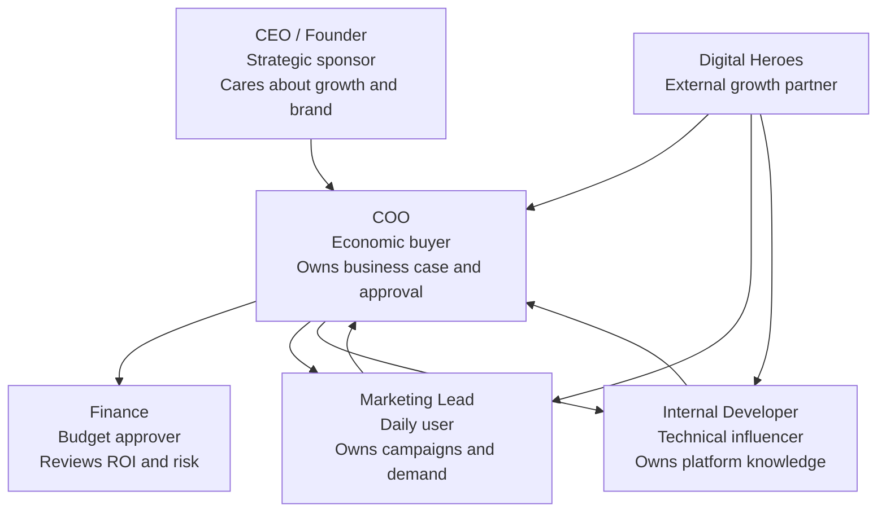
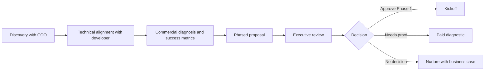

# Task B — Competitive Deal Strategy

## Scenario framing

Digital Heroes is competing for a commercially important website, Shopify, and performance marketing engagement where the COO is the economic buyer and an internal developer is an influential technical stakeholder. The buyer wants faster growth, clearer accountability, and lower execution risk, but there is internal concern that an agency may duplicate or undermine existing development capability.

## Deal strategy

### Primary win theme

Position Digital Heroes as the partner that helps the COO turn digital execution into measurable business performance while making the internal developer more effective, not less relevant.

The strategy is to win on commercial certainty, operating cadence, technical partnership, and phased risk reduction rather than on lowest price.

### Winning the COO

| COO priority | Digital Heroes response |
|---|---|
| Predictable execution | Present a phased roadmap with clear decision gates, timelines, owners, and acceptance criteria. |
| Revenue impact | Tie work to conversion rate, lead quality, average order value, campaign efficiency, site speed, and operational throughput. |
| Risk control | Begin with discovery and quick wins before committing to full transformation. |
| Accountability | Provide weekly status reporting, commercial KPIs, risk logs, and executive checkpoints. |
| Vendor confidence | Demonstrate how Shopify development, web execution, and performance marketing are coordinated under one operating model. |

The COO should feel that Digital Heroes reduces management burden, creates measurable progress, and gives leadership a defensible basis for investment.

### Handling the internal developer

The internal developer should be treated as a partner and source of institutional knowledge, not as an obstacle.

| Concern | Response |
|---|---|
| Fear of replacement | Clarify that Digital Heroes owns surge capacity, specialist delivery, and growth execution while the internal developer remains the product and systems expert. |
| Technical control | Propose shared technical standards, code review points, documentation, and handover protocols. |
| Legacy knowledge | Invite the developer into discovery to identify constraints, dependencies, and previous lessons learned. |
| Quality concerns | Use agreed acceptance criteria, staging reviews, QA checklists, and release plans. |
| Workload pressure | Position the engagement as a way to remove backlog, unblock revenue work, and reduce ad hoc requests. |

## Stakeholder map

| Stakeholder | Role in deal | Likely view | Required action |
|---|---|---|---|
| COO | Economic buyer and decision owner | Wants growth with operational control | Lead with ROI, risk reduction, governance, and phased commitment. |
| CEO / Founder | Strategic sponsor | Wants confidence that the brand and growth agenda are protected | Provide a concise executive narrative and expected business outcomes. |
| Internal developer | Technical evaluator and possible blocker | May worry about quality, ownership, and replacement | Engage early, define collaboration model, and give technical transparency. |
| Marketing lead | User and beneficiary | Needs faster campaign execution and better conversion | Show how Digital Heroes improves launch speed and campaign performance. |
| Finance | Budget and commercial scrutiny | Tests cost, payback, and alternatives | Provide ranges, phase gates, and measurable success criteria. |

## Competitive positioning

| Alternative | Buyer appeal | Weakness | Digital Heroes positioning |
|---|---|---|---|
| Internal developer only | Lower direct cost and existing knowledge | Limited bandwidth, limited performance marketing capability, slower delivery | Keep internal ownership while adding specialist capacity and commercial discipline. |
| Low-cost freelancer | Flexible and inexpensive | Key-person risk, limited strategic accountability, inconsistent process | Offer accountable delivery, QA, documentation, and cross-functional expertise. |
| Web design agency | Strong visual output | May not connect design to revenue, analytics, or campaigns | Lead with conversion, tracking, growth loops, and operational adoption. |
| Performance marketing agency | Acquisition expertise | May push more traffic into a weak website experience | Fix the full click-to-conversion path. |
| Large consultancy | Senior credibility | Expensive, slower, and potentially over-engineered | Provide practical consulting quality with implementation speed. |

## Sales process

## Risk analysis

| Risk | Probability | Impact | Mitigation |
|---|---:|---:|---|
| Internal developer blocks the decision | Medium | High | Involve the developer early, define shared ownership, and document technical governance. |
| COO sees agency as discretionary cost | Medium | High | Anchor the proposal to revenue leakage, productivity, and measurable operating outcomes. |
| Scope expands without budget control | High | Medium | Use phases, change control, backlog prioritization, and decision gates. |
| Buyer compares only on price | Medium | Medium | Reframe comparison around risk, speed, accountability, and total commercial impact. |
| Data or platform access is delayed | Medium | Medium | Include access requirements and kickoff dependencies in the proposal. |
| Results expectations become unrealistic | Medium | High | Separate controllable deliverables from market outcomes and agree KPI ranges. |

## Recommended close strategy

1. Secure agreement from the COO that current digital execution is constraining commercial performance.
2. Gain the internal developer's support by making collaboration explicit.
3. Offer a low-risk Phase 1 diagnostic with defined outputs and a credit toward Phase 2 if approved.
4. Present the full roadmap as optionality, not a forced commitment.
5. Close on the next decision, not the entire future program.
