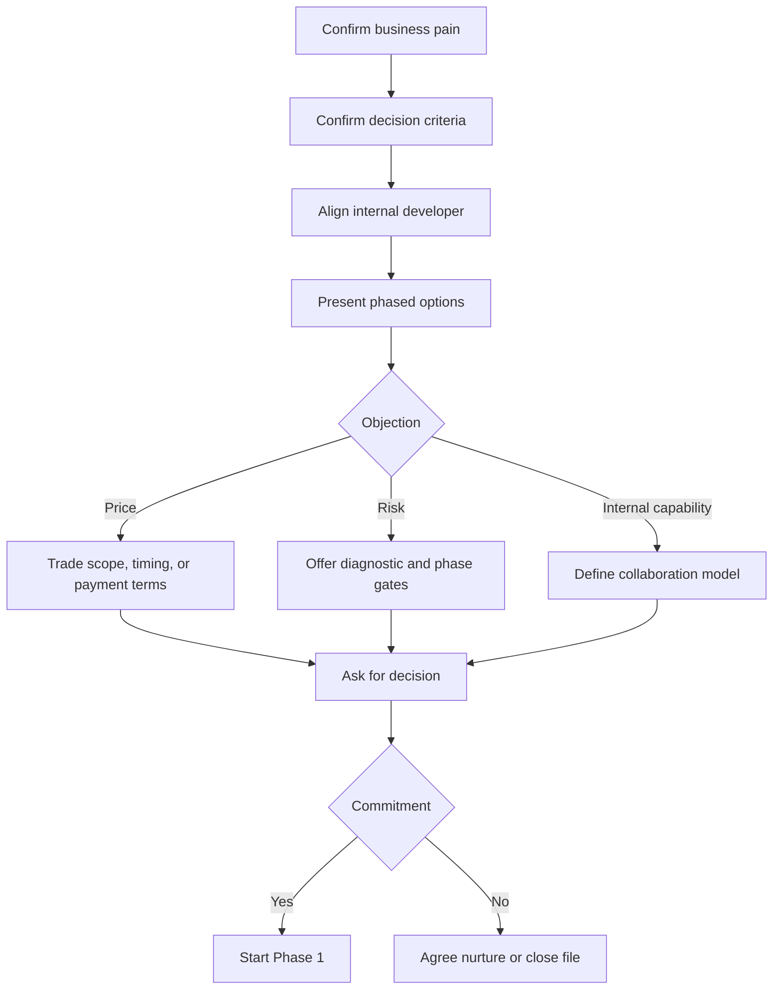

# Negotiation Framework

## Negotiation objective

Win a profitable, strategically useful engagement without over-discounting, over-scoping, or creating conflict with the internal developer. The preferred outcome is approval of a paid diagnostic with a pre-agreed path into implementation.

## BATNA

Digital Heroes' BATNA is to decline an under-scoped or under-priced full engagement and instead offer a paid diagnostic, limited audit, or future re-engagement when the client has clearer urgency and budget.

The client's BATNA is to rely on the internal developer, hire a freelancer, or defer the project. The negotiation should make clear that those options may preserve cash but do not solve capacity, accountability, or growth execution risk.

## Negotiation flow

## Concession ladder

| Order | Concession | What Digital Heroes asks for in return |
|---:|---|---|
| 1 | Adjust payment timing | Signed agreement and confirmed kickoff date. |
| 2 | Reduce Phase 1 scope | Clearer access to stakeholders and data. |
| 3 | Split implementation into smaller sprints | Approval of roadmap and decision date for next sprint. |
| 4 | Include one extra executive readout | Access to CEO or finance sponsor. |
| 5 | Offer implementation credit for diagnostic | Commitment to review Phase 2 within a defined window. |

Discounting should be the last concession and should only be exchanged for reduced scope, faster signature, testimonial rights, or a longer-term commitment.

## Walk-away conditions

* The buyer requires speculative unpaid strategy work before any paid engagement.
* The internal developer is excluded from technical alignment despite owning critical systems.
* The client demands guaranteed revenue outcomes outside Digital Heroes' control.
* The budget only supports low-cost staff augmentation while expecting senior strategic accountability.
* The scope, timeline, or access constraints make successful delivery unrealistic.
* The client will not identify a decision owner, approval process, or success criteria.

## Objection handling

| Objection | Response |
|---|---|
| “We can do this internally.” | “That may be true for maintenance. The question is whether the internal team has the capacity and specialist focus to solve the growth constraints quickly enough.” |
| “The price is higher than expected.” | “We can reduce the first commitment by starting with the diagnostic, but reducing the implementation below the required scope would increase delivery risk.” |
| “We do not want to disrupt our developer.” | “The model is designed around the developer. We will document standards, review technical decisions together, and remove backlog rather than bypass internal ownership.” |
| “We need guaranteed results.” | “We can commit to deliverables, cadence, and quality controls. Market outcomes should be measured against agreed KPIs, but they cannot be guaranteed without controlling all external variables.” |
| “Can you send a full plan first?” | “We can share the proposal structure and approach now. The detailed roadmap should be the output of the paid diagnostic so it is accurate and useful.” |

## Closing questions

* If Phase 1 confirms the opportunity, what would need to be true for you to approve Phase 2?
* Who besides you needs to be comfortable before we move forward?
* What risks would prevent you from signing this month?
* Would you prefer a smaller diagnostic first or a larger implementation commitment with phase gates?
* Is the internal developer comfortable joining a technical alignment session next week?
* If we can protect scope, timing, and collaboration, are you ready to approve the diagnostic?

## Decision framework

| Decision criterion | Strong-fit signal | Weak-fit signal |
|---|---|---|
| Pain | Clear revenue, conversion, speed, or execution problem | Vague interest in a redesign. |
| Authority | COO owns decision and can access finance/CEO | No clear decision owner. |
| Technical access | Developer is engaged and cooperative | Developer is resistant or excluded. |
| Budget | Buyer accepts phased paid work | Buyer expects free strategy or low-cost execution. |
| Timing | Commercial trigger exists within the next quarter | No deadline or business consequence. |
| Mutual fit | Buyer values accountability and specialist expertise | Buyer compares only hourly rates. |

Proceed when at least five of the six criteria show strong-fit signals. If fewer than four are present, qualify out or offer a lighter paid diagnostic only.
