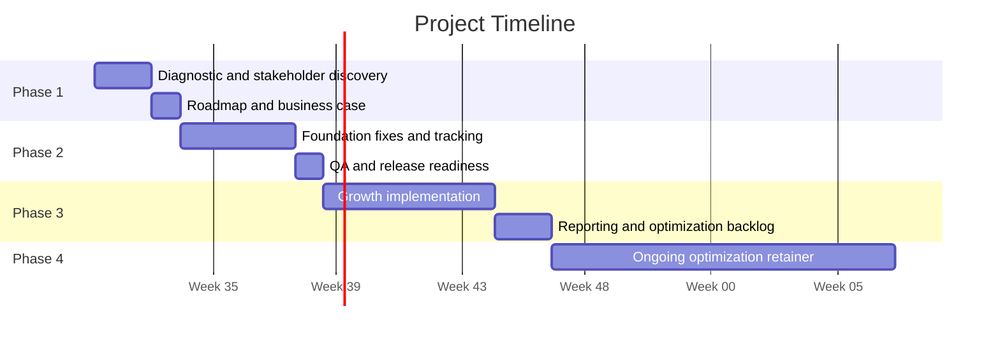

# Proposal Outline

## 1. Executive Summary

Digital Heroes recommends a phased digital growth engagement to improve the client's website performance, campaign conversion path, and execution velocity. The program is designed to help the COO reduce operational risk, support the internal developer, and connect digital work to measurable commercial outcomes.

## 2. Current State

* The business has an active digital presence but performance depends on fragmented execution.
* The internal developer holds important platform knowledge but has limited capacity for growth initiatives.
* Marketing and commercial teams need faster campaign support and clearer conversion insight.
* Leadership needs confidence that digital investment will produce measurable outcomes.

## 3. Business Problems

| Problem | Commercial impact |
|---|---|
| Slow website and campaign execution | Delays revenue initiatives and increases opportunity cost. |
| Conversion friction | Reduces return on paid and organic traffic. |
| Fragmented ownership | Creates handoff risk and unclear accountability. |
| Limited reporting clarity | Makes it difficult for leadership to prioritize investment. |
| Internal capacity constraints | Forces the developer to choose between maintenance and growth work. |

## 4. Recommended Solution

Digital Heroes should act as an external growth execution partner across strategy, development, conversion improvement, and performance marketing alignment.

The recommended solution includes:

* A paid diagnostic and roadmap.
* A prioritized implementation phase.
* Campaign and conversion improvements.
* Technical collaboration with the internal developer.
* Executive reporting and governance.
* Optional ongoing optimization retainer.

## 5. Timeline

## 6. Deliverables

| Phase | Deliverables |
|---|---|
| Diagnostic | Audit findings, stakeholder notes, technical risks, KPI baseline, prioritized roadmap. |
| Foundation | Implemented fixes, tracking cleanup, QA documentation, release plan, internal handover. |
| Growth | Landing pages, CRO backlog, campaign alignment, dashboards, executive readouts. |
| Retainer | Monthly experiments, performance reports, roadmap updates, continuous improvements. |

## 7. Pricing Structure

| Component | Pricing approach |
|---|---|
| Diagnostic | Fixed fee with clear outputs and optional credit toward implementation. |
| Implementation | Fixed project fee based on approved scope, complexity, and delivery timeline. |
| Growth support | Project fee or sprint-based package depending on campaign volume. |
| Optimization | Monthly retainer reviewed quarterly. |

## 8. FAQs

**Will this replace the internal developer?**  
No. The model is designed to support the internal developer with specialist capacity, documentation, and shared technical governance.

**Why start with a diagnostic?**  
It reduces risk, validates priorities, and prevents both sides from committing to the wrong scope.

**How will success be measured?**  
Success should be measured through agreed KPIs such as conversion rate, page speed, campaign landing page performance, lead or order quality, execution velocity, and stakeholder satisfaction.

**Can the engagement be smaller?**  
Yes. The phased model allows the client to approve the next step only when the prior phase creates confidence.

**What makes Digital Heroes different?**  
Digital Heroes combines development execution, commercial thinking, and performance marketing alignment instead of treating the website as a standalone asset.

## 9. Next Steps

1. Confirm stakeholders and decision process.
2. Schedule COO discovery and technical alignment session.
3. Approve Phase 1 diagnostic scope.
4. Complete diagnostic and roadmap.
5. Review implementation options and select the preferred path.
